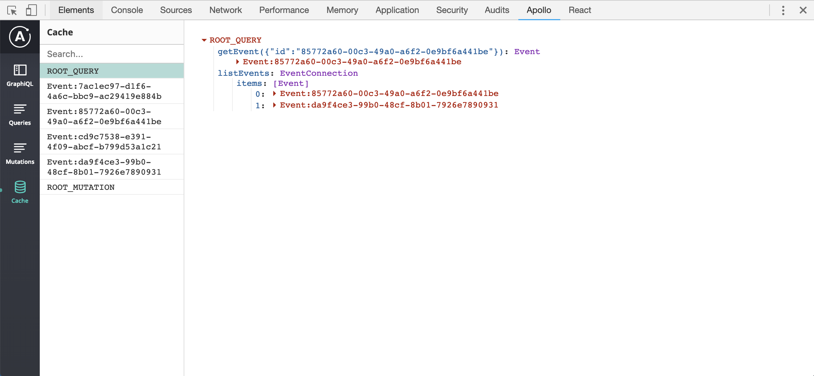

import { Head, Notes, Image } from 'mdx-deck';
import { Invert } from 'mdx-deck/layouts';

<title>Introduction to GraphQL and Apollo Client</title>

export { default as theme } from './src/theme';

# Introduction to GraphQL and the Apollo Client

<Notes>
  <ul>
    <li>What is GraphQL</li>
    <li>Why it could be interesting to maybe consider in your next project</li>
    <li>How to use it with React using the Apollo Client</li>
    <li>
      Round of with a short demo where we look at some of the UI update
      strategies
    </li>
  </ul>
</Notes>

---

# My name is Martin

---

# Who am I

- Developer & designer
- Work at AskCody

<Notes>Software for workplace optimization</Notes>

---

# What is GraphQL?

---

# A super flexible query language for your APIs

<Notes>
  <ul>
    <li>Language and specification was initially developed by Facebook</li>
    <li>Described by types and fields</li>
  </ul>
</Notes>

---

export default Invert;

# Query

<small style={{fontSize: '0.6em'}}>

```graphql
query listEvents {
  listEvents {
    items {
      id
      name
      when
      where
      description
      comments {
        items {
          commentId
          content
          createdAt
        }
      }
    }
  }
}
```

</small>

---

export default Invert;

# Response

<small style={{fontSize: '0.6em'}}>

```json
{
  "data": {
    "listEvents": {
      "items": [
        {
          "id": "da9f4ce3-99b0-48cf-8b01-7926e7890931",
          "name": "GraphQL and Augmented Reality",
          "when": "2019-03-26T14:00:00.248Z",
          "where": "Gasværksvej 26B, 1. sal, Aalborg, Denmark",
          "description": "At this meetup we will look into GraphQL ...",
          "comments": {
            "items": [
              {
                "commentId": "8d7fba80-453d-4338-8606-8ec55104144b",
                "content": "GraphQL is so cool!",
                "createdAt": "2019-03-24T20:00:00"
              }
            ]
          }
        }
      ]
    }
  }
}
```

</small>

---

# Why bother

---

# Language agnostic

<Notes>
  Service developers can make a unified API from multiple services using the
  best tools and databases for the job
</Notes>

---

# Strongly typed

<Notes>
  <ul>
    <li>Self documenting</li>
    <li>Clear and helpful errors</li>
    <li>Auto complete in e.g. GraphQL Playground</li>
    <li>
      Download your schema (Apollo CLI), and generate types in your projects
    </li>
  </ul>
</Notes>

---

# Easy to maintain

<Notes>
  <ul>
    <li>and continuiously improve over time</li>
    <li>One endpoint</li>
    <li>Enteties and fields are deprecated and removed when not in use</li>
    <li>So you don't have to worry about versions</li>
  </ul>
</Notes>

---

# Performant

<Notes>
  <ol>
    <li>Get exactly the data that you need and nothing more.</li>
    <li>Reduce size of payload</li>
    <li>Saves requests by avoiding roundtrips to the server</li>
    <li>Get data from many services in a single request</li>
  </ol>
</Notes>

---

# Great tooling

---

<Image src="./src/images/graphql-playground.png" />
<Notes>GraphQL playground</Notes>

---



<Notes>
  <ul>
    <li>Apollo client devtool</li>
    <li>Overview of active queries and mutations and their response</li>
    <li>What’s going on in the cache</li>
  </ul>
</Notes>

---

# Multiple clients

- Relay
- AWS Amplify
- Apollo Client

---

# Apollo Client

<Notes>
  <ol>
    <li>
      Clients for React and React native and all major frontend
      libraries/frameworks incl. native iOS and android
    </li>
    <li>Activly developed</li>
    <li>Conserned about backwards compatibility</li>
    <li>Good documentation</li>
    <li>Query, Mutation and Subscription components</li>
    <li>
      Caching - one of your problems taken care of. Now you just have to come up
      with good names
    </li>
  </ol>
</Notes>

---

export default Invert;

# Apollo Client

<small style={{fontSize: '0.6em'}}>

```jsx

const client = new ApolloClient({
  uri: 'graphqlEndpoint',
  request: async operation => {
    operation.setContext({
      headers: {
        ...
      },
    });
  },
});

ReactDOM.render(
  <ApolloProvider client={client}>
    <App />
  </ApolloProvider>,
  ...
);

```

</small>

<Notes>Apollo Boost - makes it really easy to get started.</Notes>

---

# Query

export default Invert;

<small style={{fontSize: '0.6em'}}>

```jsx
const GET_EVENT = gql`
  query getEvent($id: ID!) {
    getEvent(id: $id) {
      id
      name
      when
      where
      description
    }
  }
`;

export default function GetEvent() {
  return (
    <Query query={GET_EVENT} variables={{ id: eventId }}>
      {({ loading, error, data }) => {
        if (loading) return <p>Loading...</p>;
        if (error) return <p>Error :(</p>;

        return <Event data={data.getEvent} />;
      }}
    </Query>
  );
}
```

</small>

<Notes>
  <ol>
    <li>Pass a function to the children prop</li>
    <li>
      Passes state and other data to the function which you can access as
      argument in the function signature outside of the Query component
    </li>
    <li>poll interval</li>
    <li>prefetching data</li>
    <li>! = non nullable</li>
  </ol>
</Notes>

---

# Mutation

export default Invert;

<small style={{fontSize: '0.6em'}}>

```js
const UPDATE_EVENT = gql`
  mutation updateEvent(
    $id: ID!
    $name: String!
    $when: String!
    $where: String!
    $description: String!
  ) {
    updateEvent(
      id: $id
      name: $name
      when: $when
      where: $where
      description: $description
    ) {
      id
      name
      when
      where
      description
    }
  }
`;
```

</small>

---

# Mutation

export default Invert;

<small style={{fontSize: '0.6em'}}>

```jsx
return (
  <Mutation mutation={UPDATE_EVENT}>
    {updateEvent => (
      <form
        onSubmit={event => {
          event.preventDefault();
          updateEvent({
            variables: { id, name, when, where, description },
          });
        }}
      >
        ...
      </form>
    )}
  </Mutation>
);
```

</small>

<Notes>
  <ol>
    <li>update</li>
    <li>optimistic UI</li>
  </ol>
</Notes>

---

# Demo

<Notes>
  Stategies for updating our UI. We will mostly talk about the Cache.
</Notes>

---

# ?
